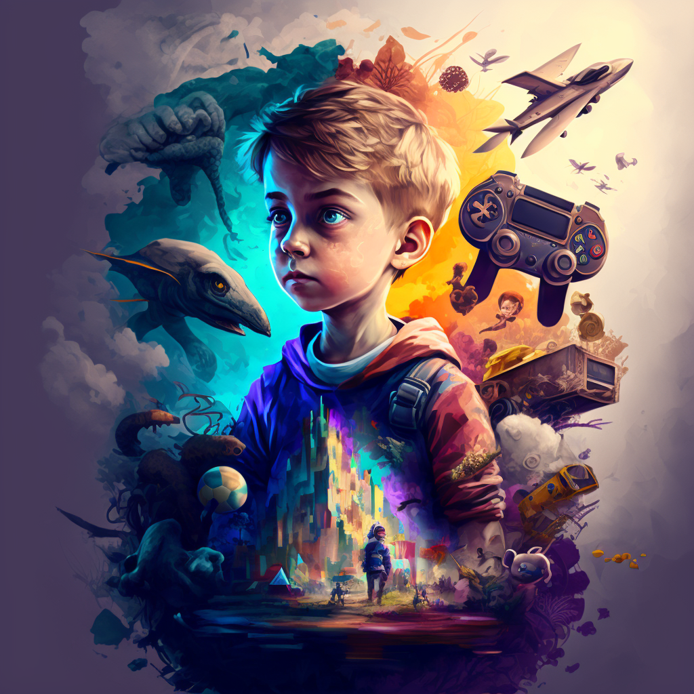

## ¿Cómo empiezo a crear videojuegos?

Note:

Ideas
- Presentación cómo se crea un videojuego
- Presentación lo que hacemos en Alberti
- Presentación lo que hacemos en curso especialización (participar en JAMs, proyectos)
- Jugar a Baker´s Bizarre Adventure (premio stickers)
- Presentación lo que vamos a hacer (Málaga JAM, Boss Rush, Dualiza) -> Cuentas en Twitter
- Creación de cuenta en itch.io
- Creación de juego básico en GDevelop
- Publicar juego en itch.io y participar en Jam
- Competición 0 Hour (premio alfombrilla, directo o diferido)

Ideas descartadas
- Kahoot o similar con preguntas
- Guía de cada cosa
- Vídeos de Gdevelop subtitulados español
---

---
## ¿Quién?
---
## ¿Cómo?
GDD
Motores
Metodología SCRUM
---
## ¿Cuándo?
Escalabilidad
Pequeños juegos bien hechos
JAM
---
## Importancia Marketing
---
## Grados Superiores en IES Rafael Alberti
---
## Curso especialización ciber
---
## Curso especialización IA
---
## Curso especialización videojuegos
---

<!-- .slide: data-background-video="../assets/searching.mp4" data-background-opacity="0.6" data-background-video-loop data-background-video-muted-->

## ¿Dudas?