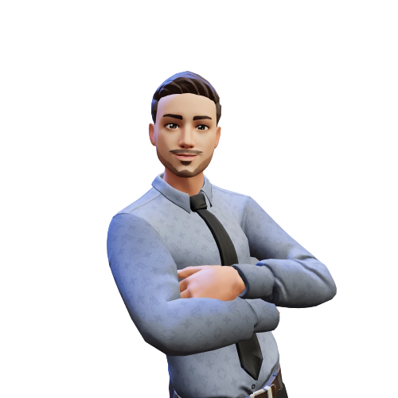
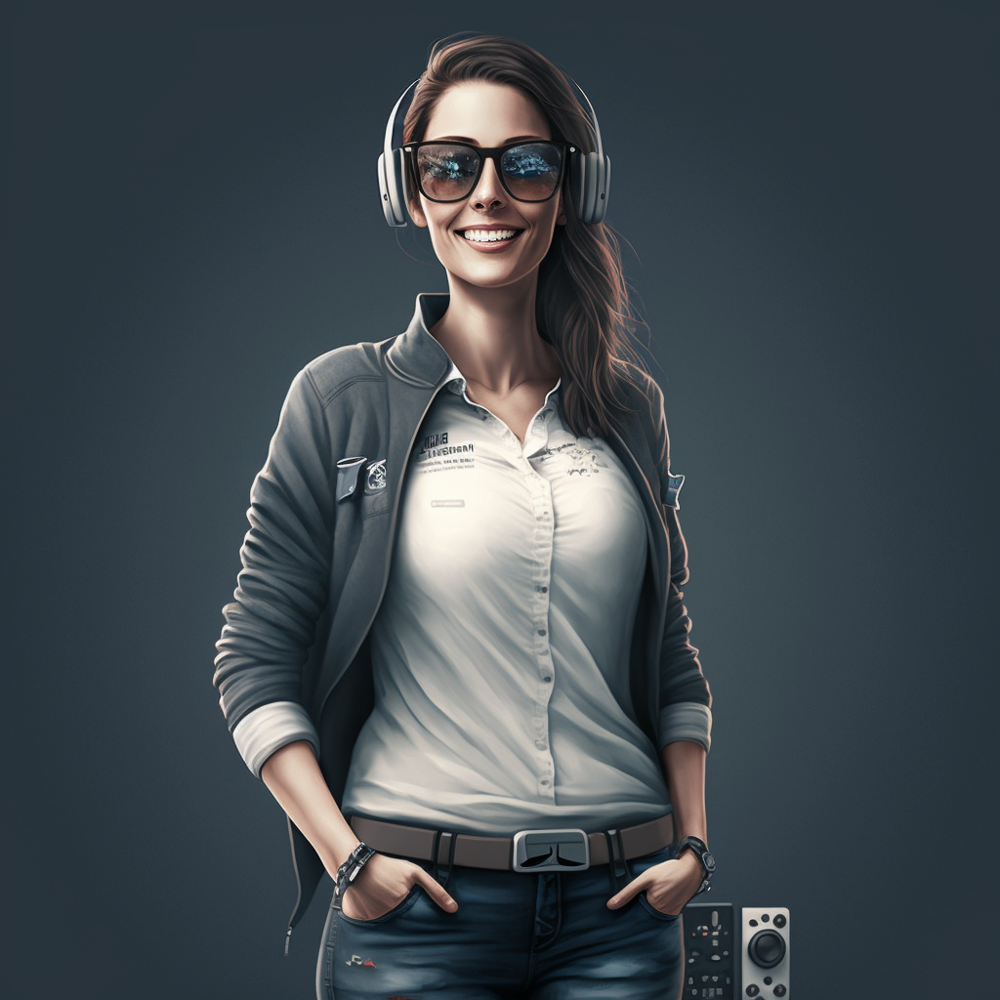
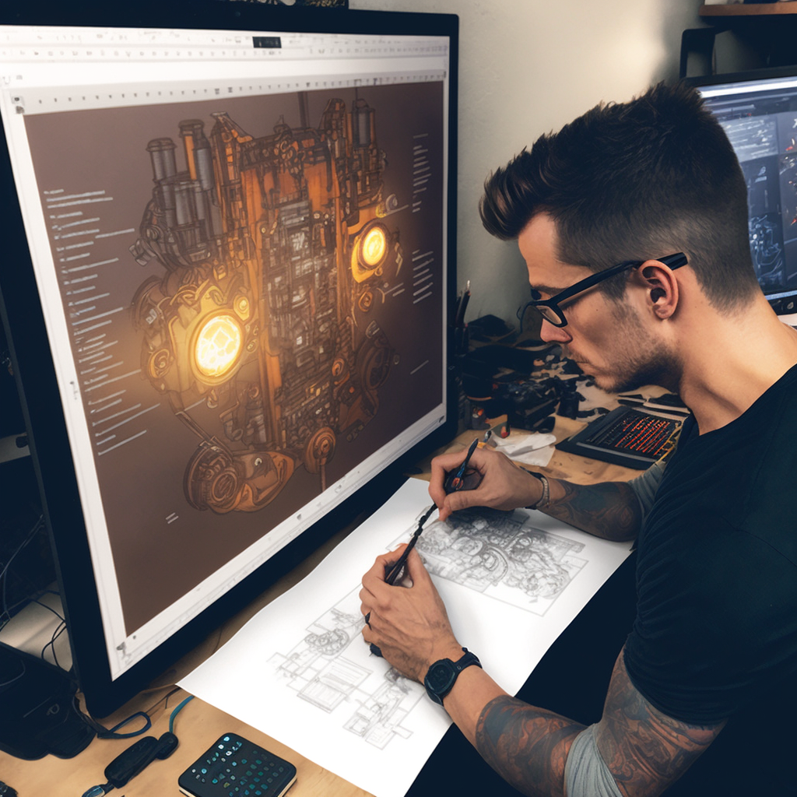
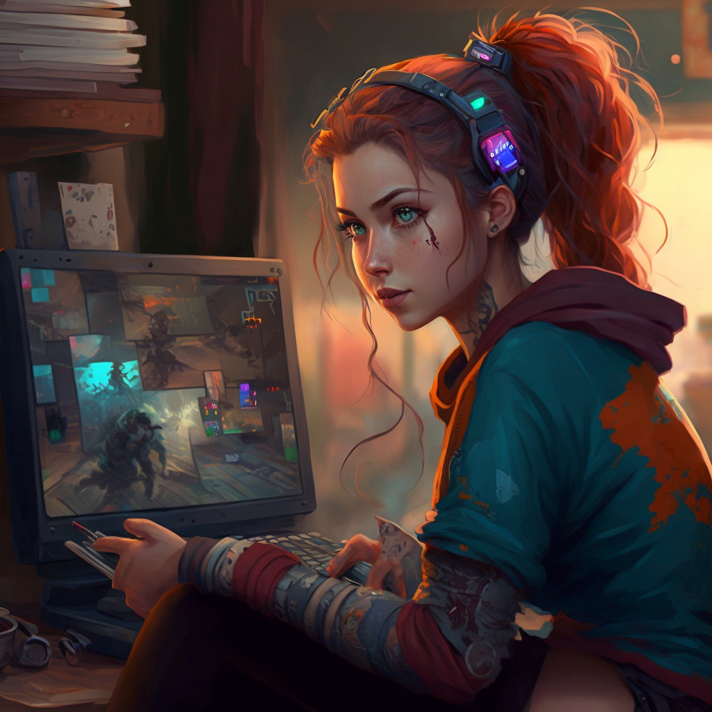

## ¿Cómo empiezo a crear videojuegos?

Note:

Ideas
- Presentación cómo se crea un videojuego
- Presentación lo que hacemos en Alberti
- Presentación lo que hacemos en curso especialización (participar en JAMs, proyectos)
- Jugar a Baker´s Bizarre Adventure (premio stickers)
- Presentación lo que vamos a hacer (Málaga JAM, Boss Rush, Dualiza) -> Cuentas en Twitter
- Creación de cuenta en itch.io
- Creación de juego básico en GDevelop
- Publicar juego en itch.io y participar en Jam
- Competición 0 Hour (premio alfombrilla, directo o diferido)

Ideas descartadas
- Kahoot o similar con preguntas
- Guía de cada cosa
- Vídeos de Gdevelop subtitulados español
---
## ¿Quién soy?

<small>hola@davidlms.com</small>
---
## ¿Quién hace un videojuego?

## Productor/a

## Diseñador/a

## Artista

## Programador/a

## ¡Y estos solamente son los principales!

Músicos <!-- .element: class="fragment" -->

Guionistas <!-- .element: class="fragment" -->

Technical Artist <!-- .element: class="fragment" -->

Marketing y RRSS <!-- .element: class="fragment" -->

Publisher <!-- .element: class="fragment" -->

Más info en [intogames.org/careers](https://intogames.org/careers)
---
## ¿Cómo se hace un videojuego?

## Game Design Document (GDD)

El documento base del videojuego <!-- .element: class="fragment" -->

Lo escribe el equipo de diseño <!-- .element: class="fragment" -->

Contiene todo lo que debe saber el resto de los equipos para crear el videojuego <!-- .element: class="fragment" -->

## Motores de desarrollo

Unity (C#) <!-- .element: class="fragment" -->

Unreal Engine (Blueprint, C++) <!-- .element: class="fragment" -->

Motores propietarios (C++) <!-- .element: class="fragment" -->

## Metodología SCRUM

<small>Fuente: netmind.net</small>

## Importancia del Marketing

En 2021 se han lanzado 28 videojuegos cada día <!-- .element: class="fragment" -->

Si no vendes no puedes continuar ni crecer <!-- .element: class="fragment" -->

La importancia de darse visibilidad <!-- .element: class="fragment" -->
---
## ¿Cuándo empiezo a hacer videojuegos?

## Hoy

Juegos pequeños bien hechos <!-- .element: class="fragment" -->

## La escalera de la escalabilidad

Enfócate en un género o temática aumentando la complejidad <!-- .element: class="fragment" -->

## Apúntate a una Game Jam

Crea videojuegos en equipo en poco tiempo <!-- .element: class="fragment" -->

Aprendes mucho <!-- .element: class="fragment" -->

Conoces gente <!-- .element: class="fragment" -->
---
## Grados Superiores en el IES Rafael Alberti

Desarrollo de Aplicaciones Web (DAW) - 8,64 (8,90 en Jerez)

Desarrollo de Aplicaciones Multiplataforma (DAM) - 8,40 (9,10 en Jerez)
---
## Los cursos de especialización de informática

Ciberseguridad en Entornos de las Tecnologías de la Información

Inteligencia Artificial y Big Data

Desarrollo de Videojuegos y Realidad Virtual
---

---

---

## ¿Cómo aprendemos?

Desarrollando videojuegos y experiencias en Realidad Virtual <!-- .element: class="fragment" -->

Participando en Game Jams (GameOff 2022, Málaga Jam y Boss Rush 2023) <!-- .element: class="fragment" -->

Usando tecnología (Equipos 3060, Meta Quest 2 y Pro, traje de mocap) <!-- .element: class="fragment" -->

## Nuestra experiencia en GameOff 2022

Desarrollo de un videojuego en un solo mes, contando con un mes de formación inicial <!-- .element: class="fragment" -->

92 de 562 en categoría Gráficos <!-- .element: class="fragment" -->

197 de 562 en categoría General <!-- .element: class="fragment" -->

¡Sin crunch! <!-- .element: class="fragment" -->

## Baker´s Bizarre Adventure

## Pruébalo

<small>https://babushas.itch.io/bakerbizarreadventure</small>
---
## ¿Por dónde puedo empezar hoy?

<small>https://gdevelop.io</small>

## ¿Dónde muestro mis creaciones?

<small>https://itch.io</small>

## Demostración

Crear y publicar un juego de plataformas en 10 minutos

## Comienza nuestra JAM

<small>https://itch.io/jam/semana-tecnica-2023-la-salle-mundo-nuevo</small>

## Acceso directo a tutoriales

<small>https://www.youtube.com/@GDevelopApp/playlists?view=50&sort=dd&shelf_id=1</small>
---

<!-- .slide: data-background-video="../assets/searching.mp4" data-background-opacity="0.6" data-background-video-loop data-background-video-muted-->

## ¿Dudas?