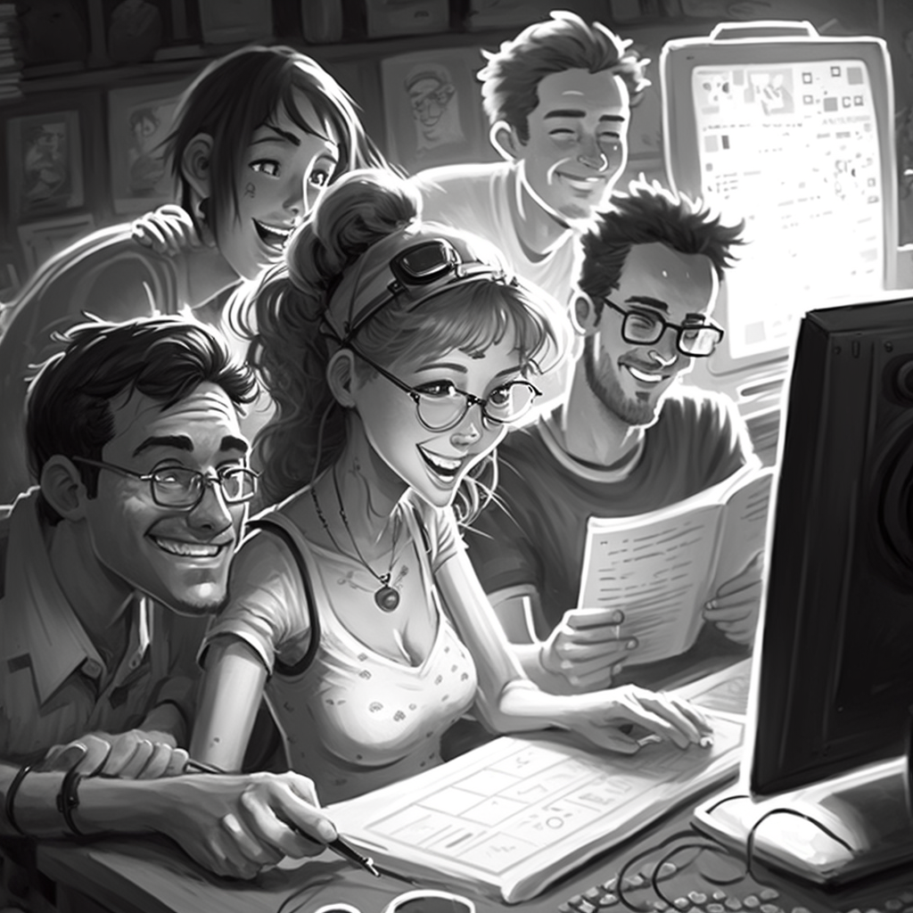
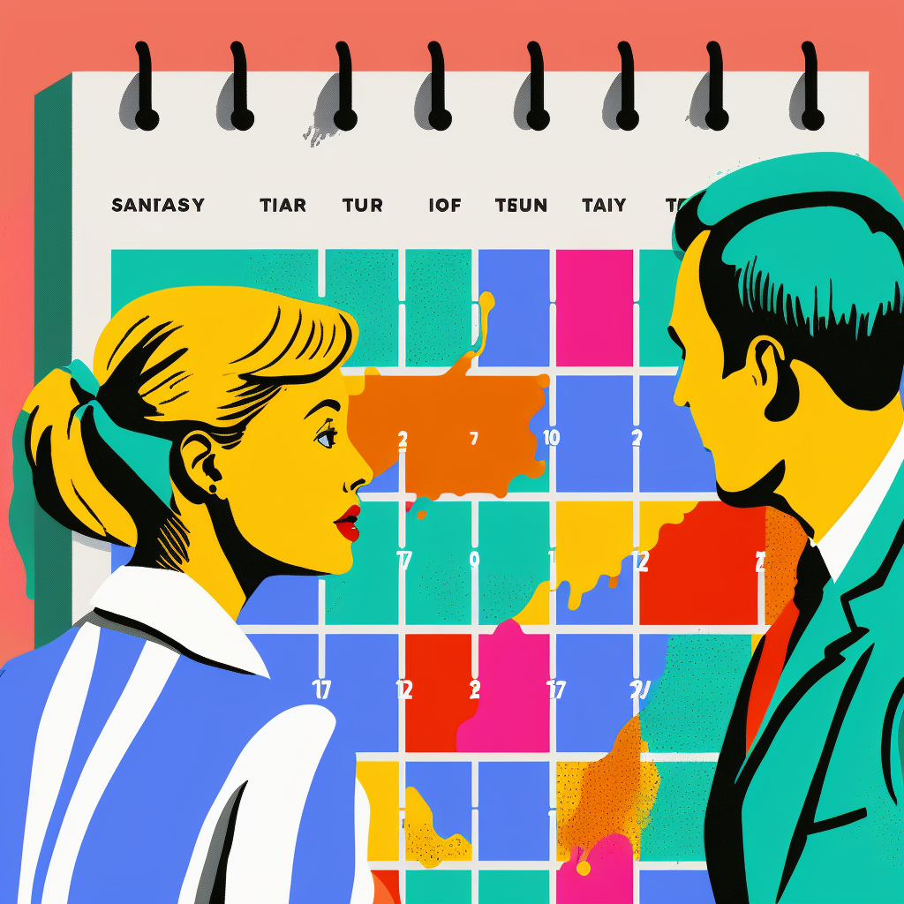
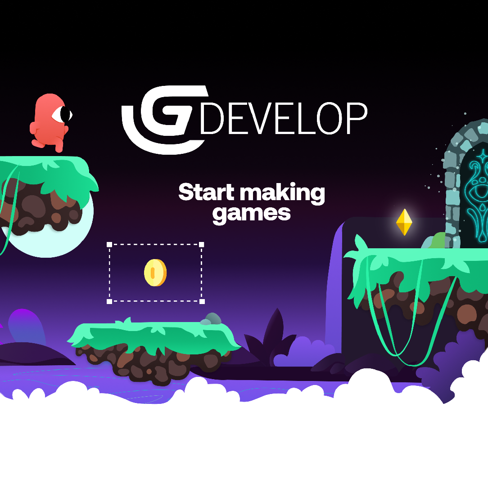

## ¿Cómo empiezo a crear videojuegos?

Note:

Ideas
- Presentación cómo se crea un videojuego
- Presentación lo que hacemos en Alberti
- Presentación lo que hacemos en curso especialización (participar en JAMs, proyectos)
- Jugar a Baker´s Bizarre Adventure (premio stickers)
- Presentación lo que vamos a hacer (Málaga JAM, Boss Rush, Dualiza) -> Cuentas en Twitter
- Creación de cuenta en itch.io
- Creación de juego básico en GDevelop
- Publicar juego en itch.io y participar en Jam
- Competición 0 Hour (premio alfombrilla, directo o diferido)

Ideas descartadas
- Kahoot o similar con preguntas
- Guía de cada cosa
- Vídeos de Gdevelop subtitulados español
---

---
## ¿Quién?

## Productor/a

## Diseñador/a

## Artista

## Programador/a

## ¡Y estos solamente son los principales!

Músicos

Guionistas

Technical Artist

Marketing y RRSS

Publisher

Más info en [intogames.org/careers](https://intogames.org/careers)
---
## ¿Cómo?

## Game Design Document (GDD)

El documento base del videojuego

Lo escribe el equipo de diseño

Contiene todo lo que debe saber el resto de los equipos para crear el videojuego

## Motores de desarrollo

Unity (C#)

Unreal Engine (Blueprint, C++)

Motores propietarios (C++)

## Metodología SCRUM

<small>Fuente: netmind.net</small>

## Importancia del Marketing

En 2021 se han lanzado 28 videojuegos cada día

Si no vendes no puedes continuar ni crecer

La importancia de darse visibilidad
---
## ¿Cuándo?

## Desde ya

Juegos pequeños bien hechos

## La escalera de la escalabilidad

Enfócate en un género o temática aumentando la complejidad

## Apúntate a las Game Jam

Crea videojuegos en equipo en poco tiempo

Aprendes mucho

Conoces gente
---
## Grados Superiores en el IES Rafael Alberti

Desarrollo de Aplicaciones Web (DAW) - 8,64 (8,90 en Jerez)

Desarrollo de Aplicaciones Multiplataforma (DAM) - 8,40 (9,10 en Jerez)
---
## Los cursos de especialización de informática

Ciberseguridad en Entornos de las Tecnologías de la Información

Inteligencia Artificial y Big Data

Desarrollo de Videojuegos y Realidad Virtual
---

---

---

## ¿Cómo aprendemos?

Desarrollando videojuegos y experiencias en Realidad Virtual

Participando en Game Jams (GameOff 2022, Málaga Jam y Boss Rush 2023)

Usando tecnología (Equipos 3060, Meta Quest 2 y Pro, traje de mocap)

## Nuestra experiencia en GameOff 2022

Desarrollo de un videojuego en un solo mes, contando con un mes de formación inicial

92 de 562 en categoría Gráficos

197 de 562 en categoría General

¡Sin crunch!

## Baker´s Bizarre Adventure

## Pruébalo

<small>https://babushas.itch.io/bakerbizarreadventure</small>
---
## ¿Por dónde puedo empezar hoy?

<small>https://gdevelop.io</small>

## ¿Dónde muestro mis creaciones?

<small>https://itch.io</small>

## Demostración

## Comienza nuestra JAM
---

<!-- .slide: data-background-video="../assets/searching.mp4" data-background-opacity="0.6" data-background-video-loop data-background-video-muted-->

## ¿Dudas?