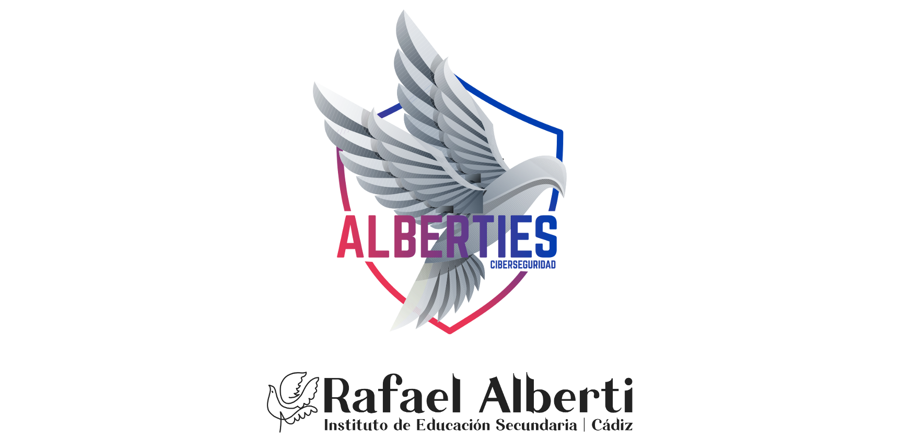

## IA en el IES Rafael Alberti

---
## ¿Quién soy?

<small>hola@davidlms.com</small>
---
## Los cursos de especialización de informática

Ciberseguridad en Entornos de las Tecnologías de la Información

Desarrollo de Videojuegos y Realidad Virtual

Inteligencia Artificial y Big Data

Desarrollo de aplicaciones en lenguaje Python
---

Experto/a en ciberseguridad

Auditor/a de ciberseguridad

Consultor/a de ciberseguridad

Hacker ético
---

Programador de videojuegos (Game Developer)

Responsable de pruebas de videojuegos (Game Tester)

Responsable del proceso de creación del videojuego (Game Designer)

Diseñador gráfico 2D y 3D de videojuegos (Game Artist)

Desarrollador independiente de videojuegos (Indie Game Developer)

Desarrollador de aplicaciones de realidad virtual, aumentada y mixta

Experto en inteligencia artificial para videojuegos
---

Desarrollador de Inteligencia Artificial y Big Data

Programador de sistemas expertos

Experto en Inteligencia Artificial y Big Data

Analista de datos

## Módulos

## Big Data

Sistemas de Big Data

Big Data aplicado

## Inteligencia Artificial

Programación de Inteligencia Artificial

Sistemas de aprendizaje automático

Modelos de Inteligencia Artificial

## ¿Cómo aprendemos?

Prácticas y proyectos del mundo real <!-- .element: class="fragment" -->

Mentoría para especializarte en tus intereses <!-- .element: class="fragment" -->

Enfoque en la continua actualización <!-- .element: class="fragment" -->

## Ejemplos de acciones realizadas

## Demostración

<small>pinokio.co</small>

Note:

Ejemplo de despliegue y FaceFusion
---

<!-- .slide: data-background-video="../assets/leaving.mp4" data-background-opacity="0.6" data-background-video-loop data-background-video-muted-->

## ¿Dudas?
---
## ¿Cómo está afectando y afectará la IA en programación?